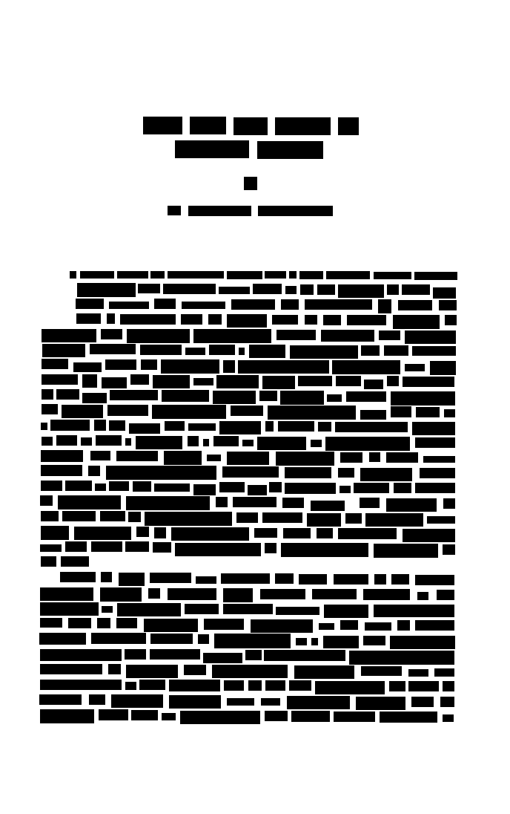
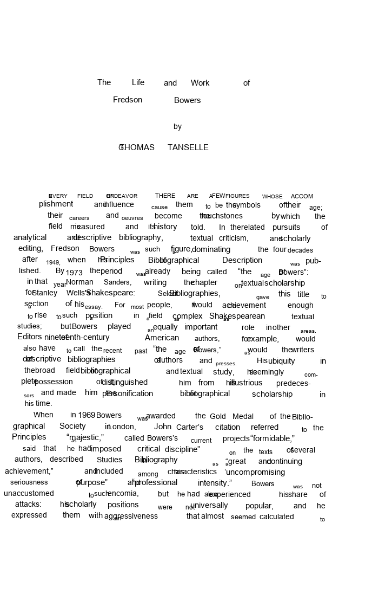

hOCRpy
======

This package extracts text, bounding box, and confidence score information from the structured
output of OCR systems like [Tesseract][]. This output, which is called [hOCR][], is a useful data
representation for identifying page formats, messy OCR, and more. In addition to providing a wrapper
around hOCR data, `hOCRpy` enables page rendering (for corpus exploration) and several ways of
analyzing the data, including:

1. Bounding box metrics
2. Format prediction

[Tesseract]: https://tesseract-ocr.github.io/
[hOCR]: http://kba.cloud/hocr-spec/1.2/

Basic Usage
-----------

`hOCRpy` will automatically parse a hOCR file from a filepath.

```python
from hOCRpy import hOCR

path = 'examples/hocr/one_column.hocr'
hocr = hOCR(path)

# Get tokens, their bounding boxes, and their confidence scores
for token, bbox, score in zip(hocr.tokens, hocr.bboxes, hocr.scores):
    print(token, bbox, score)
>> The [193, 157, 245, 180] 0.96
>> Life [256, 157, 304, 180] 0.96
>> and [315, 158, 360, 181] 0.96
>> Work [371, 158, 445, 181] 0.96
>> of [456, 158, 483, 181] 0.96
>> [...]

# Return a plaintext blob
hocr.text
>> 'The Life and Work of...'

# Number of tokens
hocr.num_tokens
>> 324

# Average confidence score
import numpy as np

np.mean(hocr.scores)
>> 0.9364197530864197
```

During corpus exploration, it's often helpful to get a high-level overview of a page's structure.

```python
hocr.show_structure(which='token')
```



Option options include `area`, `paragraph`, and `line`. In addition to these, it's possible to
re-render the entire page, fitting each token back into its respective bounding box.

```python
hocr.show_page(outline=None, scale=True)
```



See `analysis.ipynb` for a demonstration of how `hOCRpy` may be used to analyze hOCR data.
